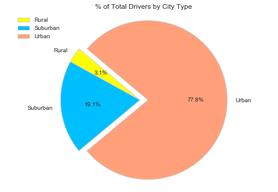
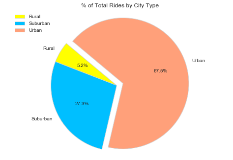
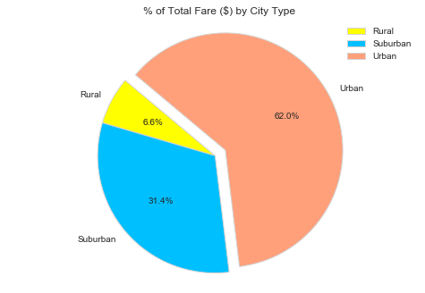

## InDrive Ride Sharing
The American-base mobility startup, founded in 2013, has become arguably Russia’s first superapp.
It makes sense from the perspective of the customer for a business like InDrive to provide a range of services related to mobility. It's simple and intuitive for you because you have all the other data.

## Objective
In this project, we will be observing the success of well-known players like Grab and InDrive. Offering data-supported advice on fresh chances for market differentiation will be expected of us in this data analysis.

Today, a sample recordset of rides has been provided to us. Details like city, driver count, individual fares, and city type are included in this, along with information about every active driver and historic ride.

We took a sample dataset of InDrive rides in various cities, and attempted to visualize the relationship between various aspects and understand what drives the average fair of InDrive rides in various type of cities.
1. InDrive is the most well-liked option for drivers and riders in urban areas, with suburban coming in second.
2. InDrive costs are comparatively lower in urban areas.
3. There is a relationship between the number of drivers and rides in the city.

# City Summary 

<table border="1" class="dataframe">
  <thead>
    <tr style="text-align: right;">
      <th></th>
      <th>city</th>
      <th>driver_count</th>
      <th>type</th>
      <th>Total Rides (per City)</th>
      <th>Average Fare ($)</th>
      <th>Total Fare ($)</th>
    </tr>
  </thead>
  <tbody>
    <tr>
      <th>0</th>
      <td>Air Keroh</td>
      <td>43</td>
      <td>Urban</td>
      <td>30</td>
      <td>24.627667</td>
      <td>738.83</td>
    </tr>
    <tr>
      <th>1</th>
      <td>Alor Setar</td>
      <td>55</td>
      <td>Urban</td>
      <td>34</td>
      <td>22.223235</td>
      <td>755.59</td>
    </tr>
    <tr>
      <th>2</th>
      <td>Ampang</td>
      <td>12</td>
      <td>Urban</td>
      <td>42</td>
      <td>24.745476</td>
      <td>1039.31</td>
    </tr>
    <tr>
      <th>3</th>
      <td>Bahau</td>
      <td>26</td>
      <td>Suburban</td>
      <td>2</td>
      <td>37.835000</td>
      <td>75.67</td>
    </tr>
    <tr>
      <th>4</th>
      <td>Bandar Baru Bangi</td>
      <td>68</td>
      <td>Urban</td>
      <td>24</td>
      <td>22.879167</td>
      <td>549.10</td>
    </tr>
  </tbody>
</table>

# Rides by City Type

# Drivers by City Type

# Fare by City Type

## Notable Trends

- Urban locations have a naturally high population density, whereas rural areas have a low population density and suburban areas fall somewhere in the centre. According to the research, urban drivers face more competition than suburban and rural drivers, a lower price structure and hence a reduced profit margin.
- A crucial takeaway would be to identify settlements with a high demand for rides, and then supply that need, especially in select suburban locations. The three pie charts depicting "% of Total Fares by City Type," "% of Total Rides by City Type," and "% of Total Drivers by City Type" definitely illustrate that rural areas have greater fare totals in relation to total rides and drivers than suburban and urban locations.
- While metropolitan areas had more drivers and more rides, the average fare was less, which could result in lower profit margins, despite accounting for 62.7% of revenue.

## 🖥️ I've shared my insights about

Groceries are one of the most popular consumer purchasing categories, but don't expect great margins, and every percentage point counts. What we are calling for is an open market, with no restrictions on competition. In reality, no other platform can provide five items as we do: ride-hailing, scooters, car sharing, restaurant delivery, and grocery delivery.

InDrive's entry into Malaysia is opportunistic because the startup can capitalise on an existing supply of drivers to launch its ride-hailing service. This launch can also be used to gain a better understanding of neighbouring countries on the ground. However, the startup does not intend to grow into larger areas. InDrive, headquartered in Mountain View, is attracting existing ride-hailing drivers to its platform for at least the next six months. It further stated that customers would receive 15% reduced service prices than competitors on the market.

Similar to the view provided to customers in Europe and Africa, InDrive will provide Nepal riders in Malaysia with safety features such as a dedicated SOS button and a "Share my ride" option for real-time trip sharing. Malaysia's ride-hailing market is not limited to the country's main urban economy, the capital city, which sees high demand from both locals and visitors.

## References
1. Klopper, S. (2021). Techcrunch: startup and technology news website review. Journal of Business & Finance Librarianship, 26(3-4), 344-349.  2. Gillet, K. (2022, January 11). Bolt raises big (again) as it looks to expand its mobility empire. Sifted. https://sifted.eu/articles/bolt-raises-628m-superapp 

